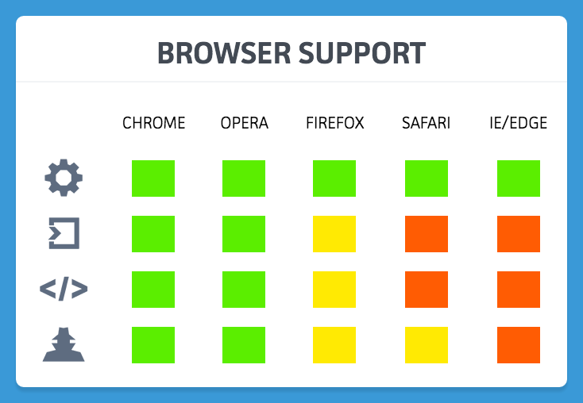
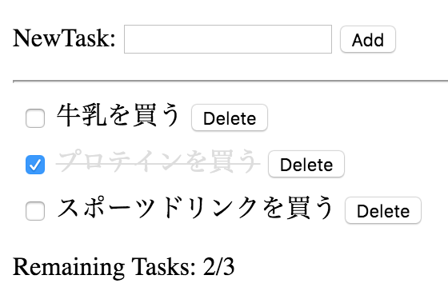

# Vue.jsでコンポーネント入門！ハンズオン勉強会


## Web Components とは？

- Web の再利用可能なパーツ作成の仕様


### 再利用可能なパーツを考える上での悩み

- HTML, CSS, JavaScript 3つの専用言語で構成。
- HTML の複雑な入れ子構造
- CSS の意図しない適用範囲
- JavaScript のDOM構造への依存


### 利用のメリット

- マークアップがスッキリ
- スタイルの適用範囲を絞り込む
- 複雑な構造を外部から見えなくする


### 構成するリソース

1. Shadow DOM
2. HTML Imports
3. HTML Template
4. Custom Elements


### ブラウザ対応状況





- Google 主導でブラウザベンダの足並みバラバラ
- Polyfill は製品で実装実績がとても少ない
- Polymer, X-Tag などのライブラリでも…
- 開発から4年でそろそろ？
- Vue.js ならば…


## Vue.js と Web Components

- Vue.js の2つの重要なコンセプト
  - リアクティブデータバインディング
  - コンポーネントシステム


### Vue.js のコンポーネントシステム

Custom Elements の仕様に沿った構文を実装

例えば…

- slot 要素
- is 属性


### 大規模アプリケーション例


```html
<div id="app">
  <app-nav></app-nav>
  <app-view>
    <app-sidebar></app-sidebar>
    <app-content></app-content>
  </app-view>
</div>
```


## コンポーネントの作成をやってみよう

- 前回（Vol.1）の続き
  - http://codepen.io/55enokky/pen/GqpmrP
  - 途中経過の保存のために、ログインしてForkを推奨
- Todo コンポーネントの作成
- App コンポーネントの作成


### Vol.1 成果物




### Vol.1 テンプレート

```html
<div id="my-app">
<!-- 新規タスクの追加 -->
<p>
  NewTask:
  <input type="text" v-model="newTask" />
  <button v-on:click="addTodo">Add</button>
</p>
<hr />
<!-- タスクのリスト表示 -->
<ul>
  <li v-for="todo in todos">
    <input type="checkbox" v-model="todo.isCompleted" />
    <span v-bind:class="{ 'complete': todo.isCompleted }">{{ todo.task }}</span>
    <button v-on:click="deleteTodo(todo)">Delete</button>
  </li>
</ul>
<!-- 残りタスクのカウント表示 -->
<p>Remaining Tasks: {{ remains }}/{{ todos.length }}</p>
</div>
```


### Vol.1 Vue インスタンス

```javascript
var vm = new Vue({
  el: '#my-app',  // マウントする要素
  data: {  // プロキシするすべてのプロパティ
    newTask: '',
    todos: [
      { task: '牛乳を買う', isCompleted: false },
      { task: 'プロテインを買う', isCompleted: true },
      { task: 'スポーツドリンクを買う', isCompleted: false }
    ]
  },
  computed: {  // 算出プロパティ
    remains: function() {
      var inCompleteList = this.todos.filter(function(task) {
        return !task.isCompleted;
      });
      return inCompleteList.length;
    }
  },
  methods: {  // インスタンスメソッド
    addTodo: function() {
      if (this.newTask == '') return;
      this.todos.push(
        { task: this.newTask, isCompleted: false }
      );
      this.newTask = '';
    },
    deleteTodo: function(todo) {
      this.todos.$remove(todo);
    }
  }
});
```


### 再利用可能な単位？

1. 同じページで繰り返し表示する（リスト表示）
2. サイト内で繰り返し利用する（ウィジェット表示）


### タスク1つを構成しているパーツをコンポーネント化


### Todo コンポーネント


#### HTML Template を切り出し

```html
<script type="text/template" id="t_todo">
  <li>
    <input type="checkbox" v-model="todo.isCompleted" />
    <span v-bind:class="{ 'complete': todo.isCompleted }">{{ todo.task }}</span>
    <button v-on:click="deleteTodo(todo)">Delete</button>
  </li>
</script>
```


#### 切り出した箇所をカスタム要素で置き換え

```html
<ul>
  <todo v-for="todo in todos" :todo="todo"></todo>
</ul>
```

- コンポーネントインスタンスは各自にスコープを持っている
- 子コンポーネントは親データを参照できない


#### Props

データを子コンポーネントに伝達するオプション

- HTMLの属性として記述
  - 大文字小文字の区別なし
  - ケバブケース
- 2つの修飾子
  - `.sync` を使用して two-way バインディングします
  - `.once` を使用して one-time バインディングします
- 検証要件を設定可能


#### Vueコンポーネントの作成

```javascript
var Todo = Vue.extend({
  template: '#t_todo',
  props: {
    'todo': {
      required: true
    }
  }
});
```


#### コンポーネントを登録

```javascript
var vm = new Vue({
  ...
  components: {
    Todo: Todo
  }
});
```


#### 動作の確認

- チェックマークの付け外し
- タスクの削除


#### タスクの削除

```html
<button v-on:click="deleteTodo(todo)">Delete</button>
```

- Todo コンポーネントのメソッドではない
- タスクリストは親コンポーネントが保持している
- タスクリストの操作は親コンポーネントの役目
- 子コンポーネントはイベントのみ通知
- 親子間でのイベント管理が必要に


#### カスタムイベント

コンポーネント間のイベント通信の仕組み

- `$on()` を使用してイベントをリッスンします
- `$emit()` を使用して自身のイベントをトリガーします
- `$dispatch()` を使用して親方向にイベントを送出します
- `$broadcast()` を使用して子孫方向にイベントを創出します


#### 子コンポーネントからイベントを送出

```javascript
var Todo = Vue.extend({
  ...
  methods: {
    deleteTodo: function(todo) {
      this.$dispatch('delete', todo);
    }
  }
});
```


#### 親コンポーネントでイベントをリッスン

```javascript
var vm = new Vue({
  ...
  events: {
    'delete': function(todo) {
      this.todos.$remove(todo);
    }
  }
});
```


### 小さなアプリ（ウィジェット）をコンポーネント化


### App コンポーネント


#### HTML Template を切り出し

```html
<script type="text/template" id="t_app">
  <!-- div要素で囲む -->
  <div>
    <p>
      NewTask:
      <input type="text" v-model="newTask" />
      <button v-on:click="addTodo">Add</button>
    </p>
    <hr />
    <ul>
      <todo v-for="todo in todos" :todo="todo"></todo>
    </ul>
    <p>Remaining Tasks: {{ remains }}/{{ todos.length }}</p>
  </div>
</script>
```


#### フラグメントインスタンス

- テンプレートのコンテンツは、カスタム要素を置き換える
- テンプレートは単一のルート要素を持つのが推奨


#### 切り出した箇所をカスタム要素で置き換え

```html
<app :todos="todos"></app>
```


#### Vueコンポーネントの作成

```javascript
var App = Vue.extend({
  template: '#t_app',
  // コンポーネント定義では初期データオブジェクトを返す関数として宣言する
  data: function() {
    return {
      newTask: '',
    };
  },
  props:  {
    'todos': {
      required: true
    }
  },
  ...
  components: {
    Todo: Todo
  }
});
```


#### コンポーネントを登録

```javascript
var vm = new Vue({
  el: '#my-app',
  data: {
    todos: [
      { task: '牛乳を買う', isCompleted: false },
      { task: 'プロテインを買う', isCompleted: true },
      { task: 'スポーツドリンクを買う', isCompleted: false }
    ]
  },
  events: {
    'delete': function(todo) {
      this.todos.$remove(todo);
    }
  }
  components: {
    App: App
  }
});
```


### 再利用可能なパーツの完成

```html
<div id="my-app">
  <app :todos="todos"></app>
  <app :todos="todos"></app>
  <app :todos="todos"></app>
</div>
```


### One more thing...


### App コンポーネントごとに見出しを追加


#### スロット

- コンポーネント使用者がコンテンツを追加する仕組み
- 親スコープでコンポーネントにコンテンツを追加
- 名前つきスロットで複数持つことも可能


#### テンプレートに slot 要素を追加

```html
<script type="text/template" id="t_app">
  <div>
    <slot></slot>
    ...
  </div>
</script>
```


#### App コンポーネント使用箇所で見出しを追加


```html
<div id="my-app">
  <app :todos="todos">
    <h1>メイン</h1>
  </app>
  <app :todos="todos">
    <h1>サブ</h1>
  </app>
  <app :todos="todos"></app>
</div>
```


### やってみよう


### NewTask コンポーネント


```html
<script type="text/template" id="t_newtask">
  <p>
    NewTask:
    <input type="text" v-model="newTask" />
    <button v-on:click="addTodo">Add</button>
  </p>
</script>
```


```javascript
var NewTask = Vue.extend({
  template: '#t_newtask',
  data: function() {
    return {
      newTask: '',
    };
  },
  methods: {
    addTodo: function() {
      if (this.newTask == '') return;
      this.$dispatch('add-todo', this.newTask)
      this.newTask = '';
    }
  }
});
```


```javascript
var App = Vue.extend({
  ...
  components: {
    Todo: Todo,
    NewTask: NewTask
  }
});
```


```javascript
var vm = new Vue({
  events: {
    ...
    'add-todo': function(newTask) {
      this.todos.push(
        { task: newTask, isCompleted: false }
      );
    }
  },
  ...
});
```


### 実装サンプル

http://codepen.io/naokie/pen/aZJoGP
